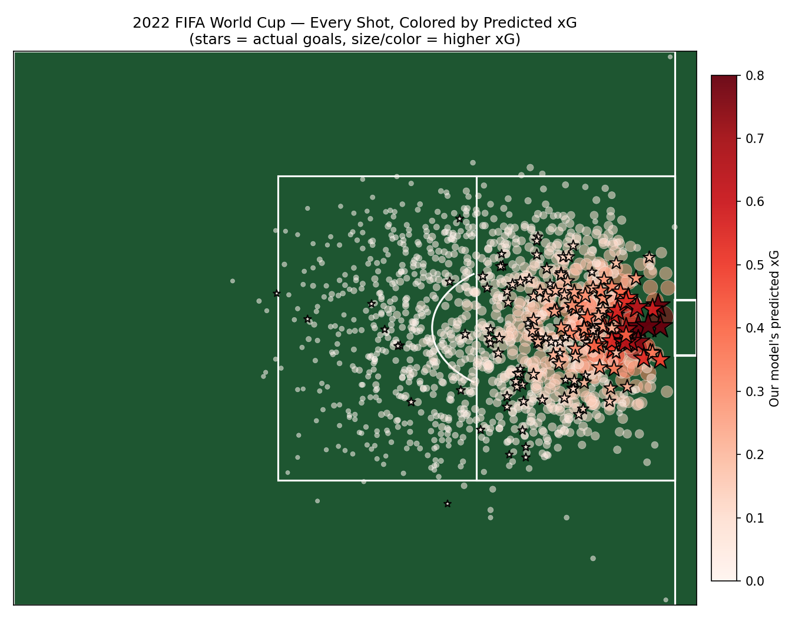
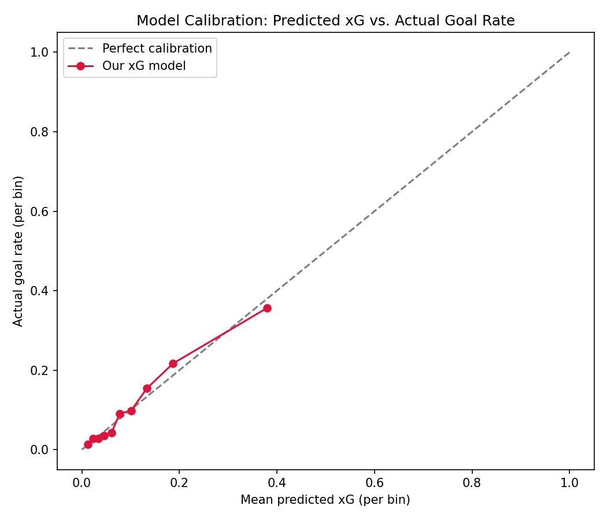

# Expected Goals (xG) Model — 2022 FIFA World Cup

A from-scratch Expected Goals model built on real event data from the 2022 FIFA
World Cup, benchmarked directly against StatsBomb's professional xG model.



## What is xG?

Expected Goals (xG) estimates the probability that a given shot results in a
goal, based on factors like shot location, angle, and body part. It's one of
the most widely used metrics in modern football analytics, used by clubs,
broadcasters, and analysts to evaluate chance quality independent of whether
the shot actually went in.

## Results

Trained a logistic regression model on 1,430 non-penalty shots from all 64
matches of the tournament:

| Metric | Value |
|---|---|
| ROC AUC | 0.759 |
| Log loss | 0.290 |
| Brier score | 0.081 |
| Correlation with StatsBomb's professional xG | 0.784 |

Despite using only 5 features (distance to goal, shot angle, body part, shot
type, and whether the shooter was under pressure), the model tracks closely
with StatsBomb's proprietary model, which additionally uses defender and
goalkeeper positioning from shot freeze-frame data.



The calibration plot shows predicted probabilities closely tracking actual
outcomes — when the model predicts a 30% chance of scoring, shots in that
bucket go in roughly 30% of the time.

## Data

Data is sourced from [StatsBomb's free open data
repository](https://github.com/statsbomb/open-data), which provides
professional-grade, event-level data (every pass, shot, and tackle with pitch
coordinates) for select competitions, including the full 2022 World Cup.

## Approach

1. **`src/fetch_data.py`** — downloads and caches raw event data for all 64
   matches
2. **`src/build_features.py`** — extracts every shot and engineers features:
   - `distance_to_goal`: straight-line distance from shot location to goal
   - `angle_to_goal`: the angle subtended by the goal mouth from the shot
     location (a proxy for "how much of the goal can the shooter see")
   - `body_part`, `shot_type`, `under_pressure`
3. **`src/train_model.py`** — trains a logistic regression pipeline
   (one-hot encoding for categorical features), evaluates on a held-out test
   set, and benchmarks against StatsBomb's own xG values
4. **`src/visualize.py`** — generates the shot map and calibration plot above

## Interactive Dashboard

A Streamlit dashboard lets you explore the model interactively: filter shots
by team or player, see a live shot map, and check an xG-overperformance
leaderboard (who's scoring more, or fewer, goals than their chance quality
predicts — a rough proxy for finishing skill).

```bash
streamlit run app.py
```

## Running it yourself

```bash
python -m venv venv
source venv/bin/activate          # venv\Scripts\activate on Windows
pip install -r requirements.txt

python src/fetch_data.py          # downloads ~64 match files (one-time)
python src/build_features.py      # builds data/processed/shots.csv
python src/train_model.py         # trains model, prints evaluation metrics
python src/visualize.py           # generates figures in notebooks/figures/
```

## Key finding

Shot conversion drops sharply with distance: **25.5%** of shots within 10
units of goal are scored, versus just **2.4%** beyond 30 units — confirming
that distance and angle alone explain most of a shot's quality, even before
accounting for defensive pressure or shot technique.

## Possible extensions

- Add defender/goalkeeper positions from StatsBomb's shot freeze-frame data
- Try a gradient-boosted model (XGBoost/LightGBM) and compare to logistic
  regression
- Extend to player-level "xG overperformance" (finishing skill) rankings
- Build an interactive Streamlit dashboard for exploring shots by team/player

## Tech stack

Python · pandas · scikit-learn · matplotlib

## Data attribution

Data provided by [StatsBomb](https://statsbomb.com/what-we-do/hub/free-data/)
under their open data license, for non-commercial research and educational
use.
